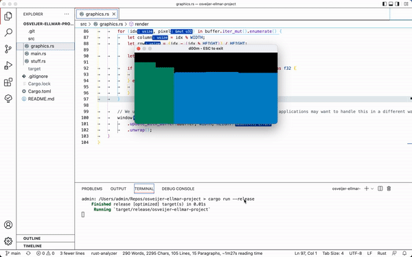

# osveijer-ellmar-project
A first person game made in rust and inspired by the original doom.

### What will be included

The project will include a graphics engine and some kind of movement system. Once this is completed further functions can be added such as shooting, enemies, different leveles or different objectives such as gathering keys. 

### Plausibility

This should not be to hard to complete since the graphics engine is very simple and the movment only includes travel in two dimensions and rotation along one axis.

### Feature progress

Features that are planed and currently being developed can be view on the [project boards](https://github.com/INDAPlus21/osveijer-ellmar-project/projects/1?query=is%3Aopen+sort%3Aupdated-desc).

### Milestones

Project will be divided according to the [milestones](https://github.com/INDAPlus21/osveijer-ellmar-project/milestones).

### Progress
Graphics and movement as of 4th may:

6th may, graphics improved, collision mechanics added:

